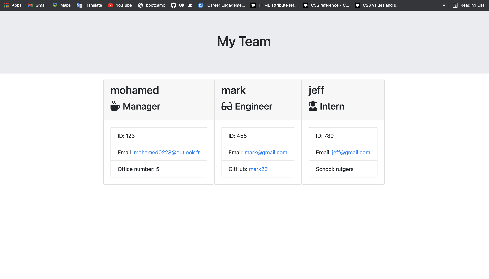

# My-Team-Profile-Generator
# Unit 10 OOP Homework: Template Engine - Employee Summary

## Description

This is a Node CLI that takes in information about employees and generates an HTML webpage that displays summaries for each person. 

### App working example
[working app gif](./src/gif.gif)

[Video Link](https://drive.google.com/file/d/1i2mhLdgij2xfIyrGL_atRBTdo-61lXOr/view)

## Installation
Run:

                npm instal

## Usage

This command-line application dynamically generates a HTML from a user's input. The application will be invoked with the following command:

                node app.js

The user will be prompted for their GitHub username and other information.

## Repository

- [Project Repo](https://github.com/mohamed0228/My-Team-Profile-Generator)
